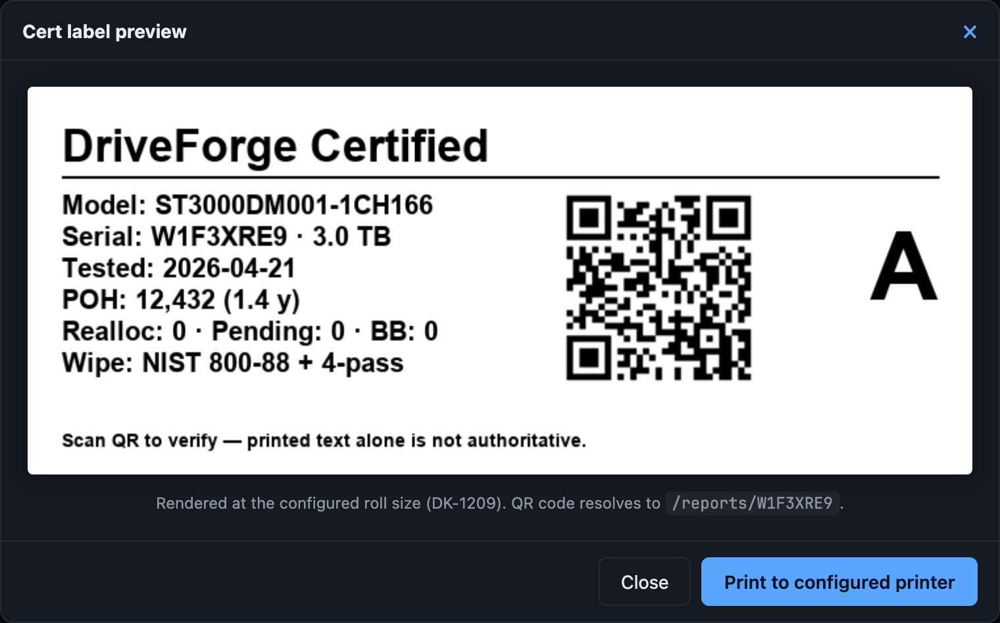

# DriveForge

**In-house enterprise drive refurbishment pipeline.**

DriveForge turns a dedicated Debian server (typically a Dell PowerEdge
R720 or a Supermicro/Nutanix NX-series) into an automated drive testing,
grading, and certification rig. Pulled enterprise drives go in;
SMART-validated, secure-erased, burned-in, graded, cert-labeled drives
come out — ready for the homelab.

The pipeline mirrors the same process commercial refurbishers run —
per-drive SMART evaluation, sector-level scanning, NIST 800-88 secure
erase, 8-pass burn-in, objective grading, and a documented cert report
with a printable sticker — packaged as open source so you can run it
on drives from any source (Facebook Marketplace, eBay, pulled lab gear,
a friend's retired NAS) and independently verify the claim before you
trust a drive with your data.

**Single-box or multi-box.** Fleet mode (v0.10+) lets one DriveForge
install — the *operator* — aggregate drives from other DriveForge
boxes — *agents* — onto a single dashboard. Plug a drive into any
agent; it shows up on the operator with a host badge. Click Enroll
next to a freshly-booted candidate on the operator's Agents page and
it joins the fleet — no tokens to copy, no shell commands. See
[Fleet mode](https://jt4862.github.io/driveforge/operations/fleet.html)
for the full multi-node guide.

- **Status**: pre-alpha, in active development
- **License**: [MIT](LICENSE)
- **Latest release**: [GitHub Releases](https://github.com/JT4862/driveforge/releases/latest)

> **Warning — drive-destructive software.** DriveForge secure-erases
> every drive it tests. The OS disk is excluded automatically, but do
> not plug any drive you want to keep into a test bay until you
> understand the workflow.

## Docs

- **📖 [Operator documentation site](https://jt4862.github.io/driveforge/)** —
  the user manual: installation, dashboard tour, auto-enroll modes,
  self-healing erase preflight, grading rules, REST API, hardware
  compatibility, known issues. Source under [`docs/`](docs/).
- **[INSTALL.md](INSTALL.md)** — getting DriveForge onto your hardware
  (ISO path + manual Debian path + air-gapped bundle)
- **[UPDATE.md](UPDATE.md)** — keeping it current once installed
- **[BUILD.md](BUILD.md)** — architecture + design decisions
- **[CONTRIBUTING.md](CONTRIBUTING.md)** — how this project handles
  issues, PRs, and forks
- **[SECURITY.md](SECURITY.md)** — reporting vulnerabilities

---

## Minimum hardware requirements

| Component | Minimum | Recommended |
|-----------|---------|-------------|
| **CPU** | Any x86_64, 2 cores | 4+ cores — DriveForge is I/O-bound, CPU rarely the bottleneck |
| **RAM** | 1 GB (single-drive testing) | 4 GB (32-drive parallel batches; ~32 MB per concurrent `badblocks` process) |
| **Boot drive** | 16 GB SSD on non-test bay | 32+ GB SSD, internal/rear slot (never a front bay — those are for drives under test) |
| **HBA** | IT-mode LSI 9200 / 9207 / 9300, or direct motherboard SATA | LSI 9207-8i (PERC H710 crossflashed) or LSI SAS2308 in IT mode |
| **Network** | Wired Ethernet (DHCP assumed) | Wired + mDNS-capable LAN so `driveforge.local` resolves |
| **OS** | Debian 12 (bookworm), x86_64 | Same |

Hardware RAID controllers are not supported — you need raw pass-through
access for SMART, SAT passthrough, and `sg_format`. Crossflash to IT
mode. See
[Supported HBAs](https://jt4862.github.io/driveforge/hardware/supported-hbas.html)
for per-controller notes.

**Validated reference hardware**: Dell R720 (PERC H710 → LSI 9207-8i) and
Supermicro/Nutanix NX-3200 (LSI SAS2308). Other IT-mode LSI cards plus
generic Adaptec / Areca / Microsemi controllers are expected to work via
SAT-3 conformance — file an issue if they don't.

---

## What it looks like


The **dashboard** is the home screen — one card per drive physically
present on the host. The layout is drive-centric (since v0.2.0) — no
bay numbers, no empty-slot placeholders, no enclosure groupings. Two
sections: **Active** (drives currently running a pipeline) and
**Installed** (present but idle, showing last grade + drive age).
Header strip shows chassis power + inlet/exhaust temps pulled live from
the BMC on hardware that supports it.


Click a drive card to see **full detail**: grade + per-rule rationale,
suggested use tier, SMART attributes, test duration, temperature during
test, phase-by-phase log output, hardware info, telemetry charts, and
full test history across every batch the drive has ever been in.


Each graded drive gets a **public cert page** at `/reports/<serial>` —
the target of the QR code on the printed label. No login required.
Shows grade, rationale, SMART attrs, and test date. Quick-mode results
are clearly marked as provisional. Exposable externally via Cloudflare
Tunnel.


Starting a batch requires typing **ERASE** to confirm — every drive you
select will be secure-erased. Quick mode (skip badblocks + long
self-test) is a toggle for faster turnaround on drives you don't need
a full certification for.



Before printing, every label gets a **preview modal** that renders it
at the configured roll size (DK-1209 by default). Pass-tier labels
(A/B/C) show drive health summary — reallocated/pending/badblocks
counts — and the years-equivalent of POH. Fail-tier labels (F) render
with a distinct `DriveForge — FAIL` title and a primary-reason line
("47 reallocated (> 40)", "12 badblocks read errors", etc.).

---

## What it does

1. **Auto-discovers drives** on plug-in (udev hotplug) and the attached
   SAS enclosure(s) via SES or SAS-layer fallback
2. **Per-drive pipeline** in parallel (up to 32 drives simultaneously,
   more with JBOD expansion):
   - Pre-test SMART baseline
   - SMART short self-test
   - Firmware version logged (manual updates only)
   - **Self-healing preflight** (v0.5.0+) — checks the drive's ATA
     security state and auto-clears lingering passwords / locks before
     the erase
   - Secure erase via transport-appropriate mechanism:
     - **SATA**: SAT passthrough (`sg_raw` + ATA-PASS-THROUGH(16) CDB)
       wrapping ATA `SECURITY ERASE UNIT` — works on modern kernels
       where legacy `hdparm --security-erase` fails
     - **SAS**: `sg_format --format` (SCSI FORMAT UNIT)
     - **NVMe**: `nvme format -s 1` (crypto-erase)
   - `badblocks -wsv` destructive 4-pattern + 4-verify sweep, eight
     passes total (skipped in quick mode)
   - SMART long self-test (skipped in quick mode)
   - Post-test SMART diff → grade A / B / C / F with per-rule
     rationale, or `error` for pipeline failures
   - Optional outbound webhook (n8n / Zapier / any HTTPS endpoint)
3. **Auto-enroll on insert** (v0.2.2+) — operator opts in via the
   dashboard header pill (Off / Quick / Full). Hotplug insertion of a
   fresh / aborted drive triggers a pipeline automatically; previously-
   graded drives stay sticky (no re-test churn).
4. **Pull-and-recover** (v0.2.2+) — drives yanked mid-erase
   auto-repair on re-insert. SAS: re-run `sg_format` to completion.
   SATA: SAT-passthrough unlock + disable. Amber-glow indicator on
   the card during recovery.
5. **Cert labels** printed on-demand from the batch or drive detail
   page (v0.5.2 enriched content: POH+years, reallocated counts, primary
   fail reason for F drives). Labels never auto-print — label stock
   doesn't get wasted on drives you haven't reviewed, and you can
   reprint if a sticker peels.
6. **One-click in-app self-update** (v0.3.1+) — Settings → About →
   Install update now. Polkit-style privilege separation; refuses if
   drives are active; dashboard auto-reconnects after the daemon
   restart.
7. **Local web UI** at `http://<hostname>.local:8080` — live drive
   state, per-drive SMART history, telemetry charts, the public
   QR-coded report page for each completed drive, plus an Ident button
   on every Installed card to blink the bay's LED for physical
   rack-location workflows.
8. **Post-run LED signaling** — after a drive finishes, its bay's
   activity LED goes to a heartbeat pattern (pass) or slow lighthouse
   (fail) so you can see what to pull from across the room. On hardware
   with proper SES backplanes, the amber fault LED also lights for
   failures.
9. **Fleet mode (v0.10+)** — scale from one box to many without
   spinning up a dashboard per server. Boot additional boxes from
   the ISO's "DriveForge Agent" menu entry; they advertise themselves
   via mDNS and appear on the operator's Settings → Agents page with
   an Enroll button. The operator then aggregates every agent's drives
   onto its single dashboard, runs the printer for the whole fleet,
   and controls fleet-wide settings like auto-enroll from one place.

---

## Sanitization standard

DriveForge's erase pipeline meets **NIST SP 800-88 Rev. 1 — Purge**,
the current authoritative media-sanitization standard (which
superseded DoD 5220.22-M for media sanitization in 2007). The pipeline
is two stacked phases, both of which happen on every drive:

**Phase 1 — Drive-level secure erase** (firmware-initiated, always runs):

| Transport | Command | Mechanism |
|-----------|---------|-----------|
| SATA | SAT passthrough: `sg_raw` + ATA-PASS-THROUGH(16) | ATA SECURITY ERASE UNIT via SCSI CDB |
| SAS | `sg_format --format` | SCSI FORMAT UNIT |
| NVMe | `nvme format -s 1 -f` | NVMe Format NVM (crypto or user-data erase) |

On SSDs this rotates the internal encryption key or block-erases the
entire flash **including over-provisioned reserve blocks that the host
cannot address** — data the host OS has no way to reach on its own. On
HDDs it's a vendor-firmware full-surface sanitize.

**Phase 2 — Verified overwrite** (full mode only; skipped in quick mode):

Eight `badblocks -wsv` passes — four patterns (`0xAA → 0x55 → 0xFF →
0x00`) with a write pass and a read-verify pass per pattern. Every
sector is written with each pattern then read back and verified.
Unrecoverable errors feed into the grade.

### How this compares

| Standard | Requirement | DriveForge |
|----------|-------------|------------|
| **NIST 800-88 Clear** | 1 overwrite pass | ✓ satisfied by any single badblocks pattern |
| **NIST 800-88 Purge** | Crypto-erase *or* firmware secure erase | ✓ Phase 1 (both quick and full mode) |
| DoD 5220.22-M (deprecated) | 3 overwrite passes | ✓ exceeded — full mode runs 4 patterns × 2 |
| DoD 5220.22-M ECE (deprecated) | 7 overwrite passes | ✓ exceeded — full mode's 8 passes meet count; Phase 1 + Phase 2 exceeds intent |

Each cert report page (`/reports/<serial>`) includes a **Sanitization**
section spelling out which phases ran for that specific drive.
Quick-mode results are clearly marked: Purge compliance is intact, but
the 4-pattern verification was skipped — re-run in full mode for a full
cert.

---

## Grade vocabulary (v0.5.1+)

| Grade | Meaning | Sticker |
|-------|---------|---------|
| **A** | Pristine: ≤ 3 reallocated sectors, no growth during burn-in, all tests passed | Cert sticker prints |
| **B** | Minor wear: ≤ 8 reallocated sectors, all tests passed | Cert sticker prints |
| **C** | Heavy wear (but stable): ≤ 40 reallocated sectors, all tests passed | Cert sticker prints |
| **F** | Real drive failed grading (bad SMART, pending sectors, badblocks errors, grown reallocation count, etc.) | Fail sticker prints with primary reason |
| **error** | Pipeline broke mid-run (SAT error, subprocess crash, preflight refusal). Drive's health unknown. | **No sticker** — nothing graded, nothing to certify |
| *(aborted / not tested)* | Operator cancelled, or never tested | No sticker |

F drives are sticky — auto-enroll won't re-test them on re-insert (the
verdict is durable). `error` drives do auto-retest on re-insert — the
error may have been transient, and re-running against a fixed code
path tells us the drive's real state.

---

## Firmware update limitations

DriveForge **logs drive firmware versions** but does not auto-flash
firmware updates. Drive firmware distribution is vendor-gated,
platform-specific, and not legally redistributable in most cases, so
updating firmware is an explicit manual operation. The UI surfaces the
current firmware version on each drive's detail page for operator
reference.

See [BUILD.md](BUILD.md) for the full design rationale on why automatic
firmware flashing is out of scope.

---

## Development

```bash
git clone https://github.com/JT4862/driveforge.git
cd driveforge
uv venv
source .venv/bin/activate
uv pip install -e '.[dev,linux]'
pytest
driveforge-daemon --dev --fixtures tests/fixtures/
# open http://localhost:8080
```

Unit tests run on any platform (they use recorded SMART/nvme/ipmi
fixtures so no real drive is needed). Real-hardware integration tests
run on a self-hosted GitHub Actions runner with a dedicated test drive
— see
[`docs/reference/integration-test-runner.md`](https://jt4862.github.io/driveforge/reference/integration-test-runner.html)
for the one-time runner setup.

See [BUILD.md](BUILD.md#development-environment) for the full dev
environment setup (macOS primary, Debian VM via Lima for integration
testing, R720 for real-hardware validation).
