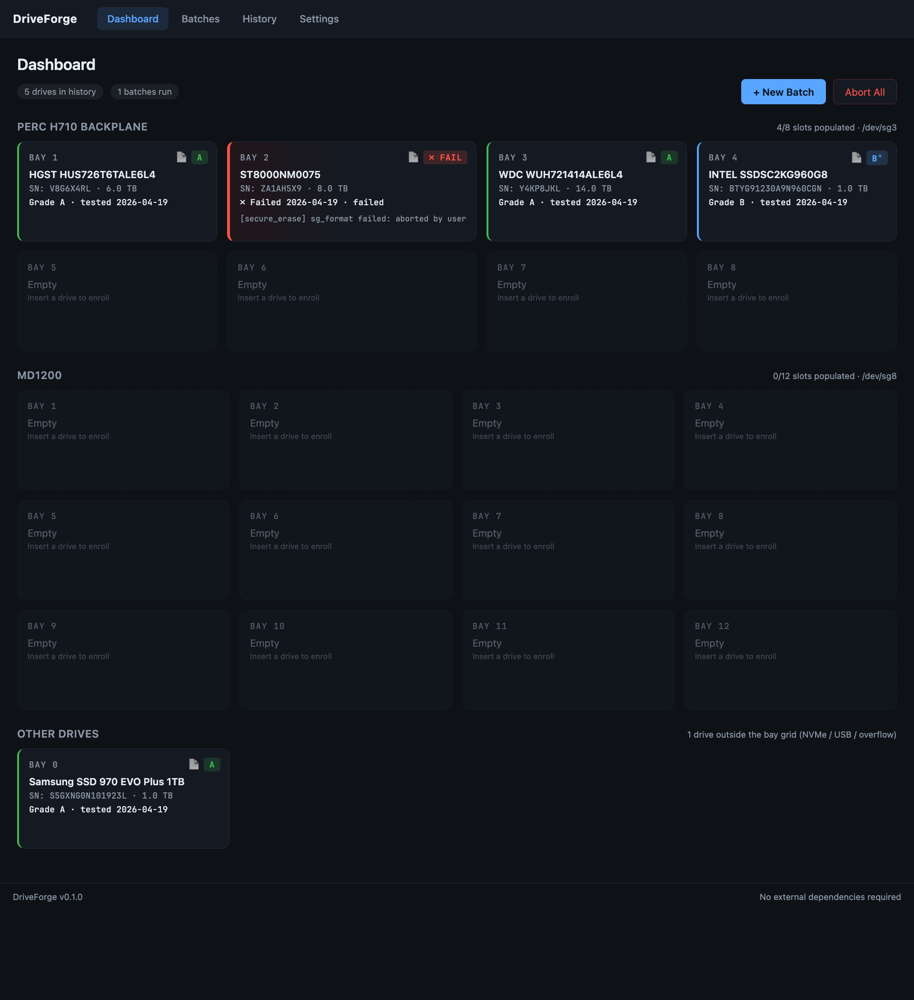
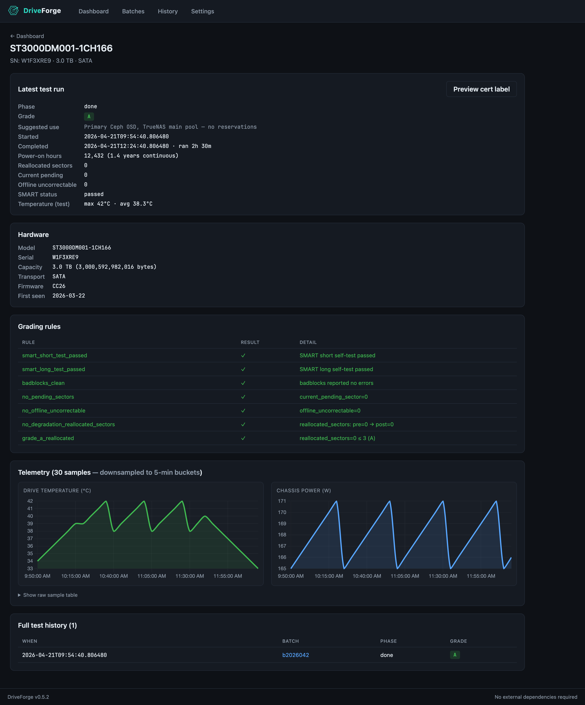
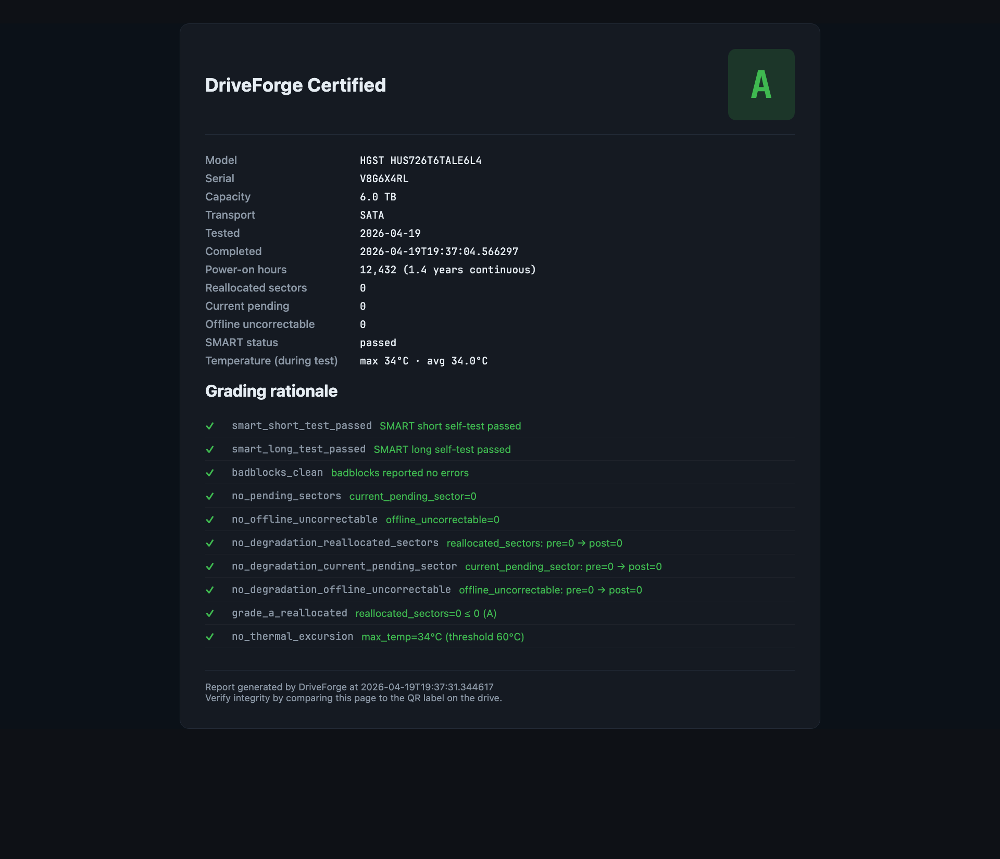
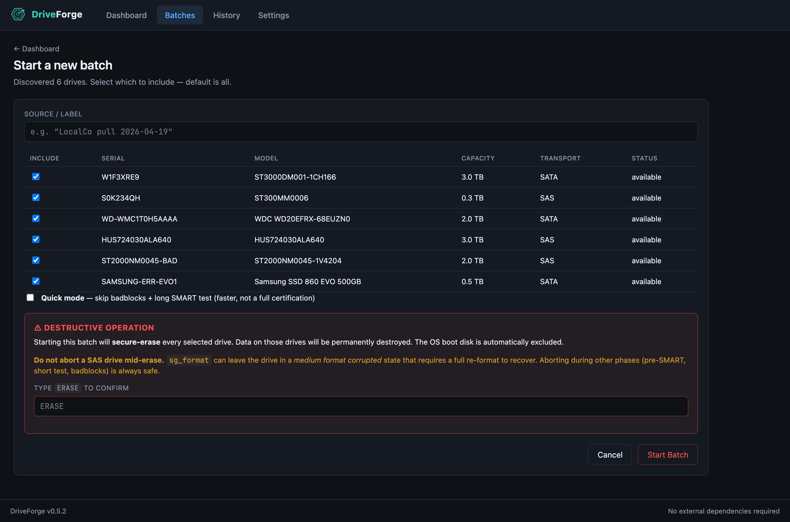

# DriveForge

**In-house enterprise drive refurbishment pipeline.**

DriveForge turns a dedicated Debian server (typically a Dell PowerEdge R720)
into an automated drive testing, grading, and certification rig. Pulled
enterprise drives go in; SMART-validated, secure-erased, burned-in, graded,
cert-labeled drives come out — ready for the homelab.

- **Status**: pre-alpha, in active development
- **License**: [MIT](LICENSE)
- **Design doc**: [BUILD.md](BUILD.md)

> **Warning — drive-destructive software.** DriveForge secure-erases every
> drive it tests. The OS disk is excluded automatically, but do not plug any
> drive you want to keep into a test bay until you understand the workflow.

---

## What it looks like



The **dashboard** is the home screen — one card per physical drive bay, grouped
by SAS enclosure (or falling back to virtual bays on direct-attach backplanes).
Each card shows at a glance whether the drive is empty, installed-idle, actively
testing, or carries a previous test result (pass / quick-mode pass / fail).



Click a bay card to see **full drive detail**: grade + rationale, suggested use
tier, SMART attributes, test duration, temperature during test, phase-by-phase
log output, hardware info, and full test history across every batch the drive
has ever been in.



Each completed drive gets a **public cert page** at `/reports/<serial>` — the
target of the QR code on the printed label. No login required. Shows grade,
rationale, SMART attrs, and test date. Quick-mode results are clearly marked
as provisional. Exposable externally via Cloudflare Tunnel.



Starting a batch requires typing **ERASE** to confirm — every drive you select
will be secure-erased. Quick mode (skip badblocks + long self-test) is a
checkbox for faster turnaround on drives you don't need a full certification
for.

---

## What it does

1. Auto-discovers drives on plug-in (udev hotplug) and the attached SAS
   enclosure(s) via SES
2. Per-drive pipeline in parallel (up to 8 drives on an R720; more with
   JBOD expansion):
   - Pre-test SMART baseline
   - SMART short self-test
   - Firmware version logged (manual updates only)
   - Secure erase (SATA `hdparm` / SAS `sg_format` / NVMe `nvme format`)
   - `badblocks` destructive write/read (skipped in quick mode)
   - SMART long self-test (skipped in quick mode)
   - Post-test SMART diff → grade (A / B / C / fail) with per-rule rationale
   - Optional outbound webhook (n8n / Zapier / any HTTPS endpoint)

   Cert labels are **printed on-demand**, not automatically, from the
   batch detail page (single "Print" per drive, or "Print all passing"
   for the whole batch) and from the drive detail page. This keeps label
   stock out of failed drives and lets you reprint if a sticker peels.
3. Serves a local web UI at `http://driveforge.local:8080` with live bay
   state, per-drive SMART history, telemetry charts, and a public QR-coded
   report page for each completed drive

---

## Sanitization standard

DriveForge's erase pipeline meets **NIST SP 800-88 Rev. 1 — Purge**, the
current authoritative media-sanitization standard (which superseded DoD
5220.22-M for media sanitization in 2007). The pipeline is two stacked
phases, both of which happen on every drive:

**Phase 1 — Drive-level secure erase** (firmware-initiated, always runs):

| Transport | Command | Mechanism |
|-----------|---------|-----------|
| SATA | `hdparm --security-erase` | ATA SECURITY ERASE UNIT |
| SAS | `sg_format --format` | SCSI FORMAT UNIT |
| NVMe | `nvme format` | NVMe Format NVM (crypto or user-data erase) |

On SSDs this rotates the internal encryption key or block-erases the
entire flash **including over-provisioned reserve blocks that the host
cannot address** — data the host OS has no way to reach on its own. On
HDDs it's a vendor-firmware full-surface sanitize.

**Phase 2 — Verified overwrite** (full mode only; skipped in quick mode):

Four full-drive write/read passes via `badblocks -wsv` using patterns
`0xAA → 0x55 → 0xFF → 0x00`. Every sector is written with each pattern
then read back and verified. Unrecoverable errors feed into the grade.

### How this compares

| Standard | Requirement | DriveForge |
|----------|-------------|------------|
| **NIST 800-88 Clear** | 1 overwrite pass | ✓ satisfied by any single badblocks pattern |
| **NIST 800-88 Purge** | Crypto-erase *or* firmware secure erase | ✓ Phase 1 (both quick and full mode) |
| DoD 5220.22-M (deprecated) | 3 overwrite passes | ✓ exceeded — full mode runs 4 verified passes |
| DoD 5220.22-M ECE (deprecated) | 7 overwrite passes | ✗ not matched by pass count, but Phase 1 + Phase 2 exceeds the intent |

Each cert report page (`/reports/<serial>`) includes a **Sanitization**
section spelling out which phases ran for that specific drive. Quick-mode
results are clearly marked: Purge compliance is intact, but the 4-pass
verification was skipped — re-run in full mode for a full cert.

---

## 1. Hardware prerequisites

**Recommended** (what DriveForge is built around):

- **Server**: Dell PowerEdge R720 or equivalent 2U rackmount (R620, R720xd,
  R730 also work)
- **HBA**: PERC H710 crossflashed to **IT mode** (9207-8i firmware) — required
  for raw SMART + SAS pass-through. Stock RAID mode will **not** work.
- **Boot drive**: a small (≥ 120 GB) SSD in an internal/rear slot. **Do not
  boot from one of the front drive bays** — those are reserved for drives
  under test.
- **Network**: wired Ethernet on the homelab LAN

**Minimum** (for anyone without enterprise hardware):

- Any x86_64 system with 4+ SATA/SAS bays
- Any HBA in IT mode or direct-attach SATA/AHCI
- Boot drive separate from the bays you'll test
- No SES / enclosure services — DriveForge falls back to a configurable
  virtual-bay count (default 8)

**Optional**:

- **JBOD expansion** (e.g. Dell MD1200, Supermicro SC846) — DriveForge
  auto-detects additional SES enclosures and expands the dashboard
- **iDRAC / IPMI** — enables chassis power telemetry
- **Thermal printer** — any Brother QL-family printer (QL-800 / QL-810W /
  **QL-820NWBc** / QL-1100 / QL-1110NWBc) for adhesive cert labels
- **DK-1209 labels** (29×62mm) — recommended Brother roll for 3.5" HDDs

### Crossflashing the PERC H710 to IT mode

Stock firmware runs the H710 as a hardware RAID controller, which hides
raw disk access behind the RAID abstraction. DriveForge needs raw
pass-through. Flash the card to the LSI 9207-8i IT firmware:

- ServeTheHome write-up: search "H710 crossflash 9207-8i" — the
  fohdeesha.com guide is the community reference
- After flashing, verify with `lspci | grep -i lsi` on any Linux box —
  you should see `SAS2308 PCI-Express Fusion-MPT SAS-2`, not `MegaRAID`

---

## 2. Install Debian 12

DriveForge runs on **Debian 12 "Bookworm"** — other distros are unsupported.

### Download the installer

Grab the latest 12.x netinst ISO:

- <https://www.debian.org/distrib/netinst>

### Write it to USB

Any of these works:

- **macOS**: `diskutil list`, then `sudo dd if=debian-12.x.0-amd64-netinst.iso of=/dev/rdiskN bs=4m`
  (replace `N` with the USB's disk number; `rdiskN` is faster than `diskN`)
- **Linux**: same `dd` idiom with `/dev/sdN`
- **Windows**: [Rufus](https://rufus.ie) or [balenaEtcher](https://www.balena.io/etcher/)

### Boot + install

1. Plug the USB into the server, boot from it (iDRAC virtual media also
   works on the R720 without a physical USB)
2. Pick **Graphical install** or **Install** — both fine
3. Language / keyboard / timezone — your preference
4. **Hostname**: set to `driveforge` (this is what mDNS advertises, so
   `http://driveforge.local:8080` works without further config)
5. **Domain**: leave blank or set to `.local`
6. Root password + first user — **pick any login name except
   `driveforge`**. That name is reserved for the DriveForge daemon's
   system account; reusing it collapses the service/admin boundary.
   Common picks: your own name, `admin`, `ops`.
7. **Partitioning**: select **"Guided – use entire disk"** on the boot SSD.
   Do **not** pick a front-bay drive — DriveForge assumes those are
   test-under-test targets.
8. **Software selection**: uncheck everything **except**:
   - `SSH server`
   - `standard system utilities`
   - (Uncheck the desktop environment — DriveForge doesn't need it)
9. Finish the installer, reboot, remove the USB

### Post-install basics

SSH in from your laptop (`ssh <user>@<server-ip>`), then:

```bash
sudo apt update
sudo apt upgrade -y
```

---

## 3. (Optional) Set a static IP

DriveForge works on DHCP, but a static IP means `http://<server-ip>:8080`
stays stable across reboots. On Debian 12 with netplan:

```bash
sudo nano /etc/netplan/01-driveforge.yaml
```

Minimal example — adjust for your network:

```yaml
network:
  version: 2
  renderer: networkd
  ethernets:
    eno1:
      dhcp4: no
      addresses: [192.168.1.50/24]
      routes:
        - to: default
          via: 192.168.1.1
      nameservers:
        addresses: [1.1.1.1, 192.168.1.1]
```

Apply with `sudo netplan apply`. Then either use the IP directly or rely on
mDNS (`driveforge.local`) once DriveForge is installed.

---

## 4. Install DriveForge

From the server's SSH session:

```bash
git clone https://github.com/JT4862/driveforge.git
cd driveforge
sudo ./scripts/install.sh
```

The installer:

- Installs system dependencies (smartmontools, hdparm, sg3-utils, nvme-cli,
  e2fsprogs, fio, tmux, ipmitool, avahi-daemon, python3-venv, etc.)
- Creates the `driveforge` system user + `/var/lib/driveforge` state dir
- Installs the Python package into `/opt/driveforge` virtualenv
- Drops symlinks at `/usr/bin/driveforge{,-daemon,-tui}`
- Writes default config to `/etc/driveforge/`
- Enables + starts `driveforge-daemon.service` and `avahi-daemon.service`
- Prints the access URLs (mDNS + raw IP) at the end

If you see the following at the end, you're ready:

```
✓ DriveForge installed and running.

Open the web UI at:
  → http://driveforge.local:8080     (mDNS, preferred)
  → http://<server-ip>:8080          (direct IP)
```

---

## 5. First-run setup wizard

Open either URL in a browser. You'll land on a five-step wizard:

1. **Welcome** — overview
2. **Hardware & network** — lists detected drives, SES enclosures, network
   state, and IPMI availability. No input required; click Next.
3. **Printer** — pick your Brother QL model + label roll, or skip (hot-plug
   later and the udev monitor configures it automatically)
4. **Grading thresholds** — A/B/C/Fail rules. Defaults are pre-populated and
   fine for most homelab use.
5. **Integrations** — outbound webhook URL + Cloudflare Tunnel hostname.
   Both optional; skip if you don't use them.

After Finish, you land on the dashboard.

---

## 6. Run your first batch

1. Plug drives you want to test into the front bays
2. Click **+ New Batch** → optionally name the source → **Start Batch**
3. Walk away. Per-drive runs take 3-5 days on 8 TB HDDs. Monitor the
   dashboard whenever you feel like it.

When a batch completes: each passing drive gets a printed cert label (if a
printer is configured) and the Twenty/n8n/whatever webhook (if configured)
fires once with the batch summary.

---

## Firmware update limitations

DriveForge can auto-apply firmware updates for NVMe drives and many SATA /
SAS drives when a signed known-good blob is available, but the following
categories are explicitly **not** supported:

- **OEM-branded drives** (Dell / HP / NetApp) — custom firmware strings
  don't accept retail blobs
- **Windows-only vendor tools** (Samsung Magician, some HGST WinDFT) —
  reported as "manual flash required"
- **Drives requiring physical power cycle after flash** — DriveForge can't
  power-cycle individual R720 bays; user reseats after commit
- **Vendor-support-gated firmware** — Dell / HP enterprise drives whose
  firmware is behind a support login

See [BUILD.md](BUILD.md#firmware-updates) for the full safety model.

---

## Troubleshooting

### `driveforge-daemon` won't start

```bash
sudo journalctl -u driveforge-daemon -n 50 --no-pager
```

Common causes: `/etc/driveforge/` isn't writable by the driveforge user
(should be fixed by `install.sh`), Python dependency install failed, or
port 8080 is already in use.

### Can't reach `http://driveforge.local:8080`

- Verify avahi is running: `systemctl status avahi-daemon`
- Verify the daemon is listening: `sudo ss -tlnp | grep 8080`
- On Windows, install Apple Bonjour to resolve `.local` hostnames
- Fall back to the raw IP: `http://<server-ip>:8080`

### No drives detected on the dashboard

- Confirm the HBA is in IT mode: `lspci | grep -i lsi` should show a
  `SAS23xx` or `9207`-family chip, **not** `MegaRAID`
- Check `sudo smartctl --scan`
- Check `lsblk` — DriveForge expects the OS disk + at least one other block
  device

### SES enclosure not detected

- Check `ls /sys/class/enclosure/`. If empty: your backplane doesn't expose
  SES (common on consumer motherboards). DriveForge falls back to the
  virtual-bay count from Settings → Daemon. Adjust if the default (8)
  doesn't match your hardware.

### Printer not auto-detecting

- Brother QLs use USB VID `0x04f9`. Check `lsusb | grep 04f9`
- If the printer is connected but DriveForge doesn't see it, restart the
  daemon: `sudo systemctl restart driveforge-daemon`

---

## Development

```bash
git clone https://github.com/JT4862/driveforge.git
cd driveforge
uv venv
source .venv/bin/activate
uv pip install -e '.[dev]'
pytest
driveforge-daemon --dev --fixtures tests/fixtures/
# open http://localhost:8080
```

See [BUILD.md](BUILD.md#development-environment) for the full three-tier
dev environment setup (macOS primary, Debian VM via Lima for integration
testing, R720 for real-hardware validation).

---

## Contributing

DriveForge is currently in pre-alpha private development. Once it's
battle-tested and flipped public, issues and PRs will be welcome.
